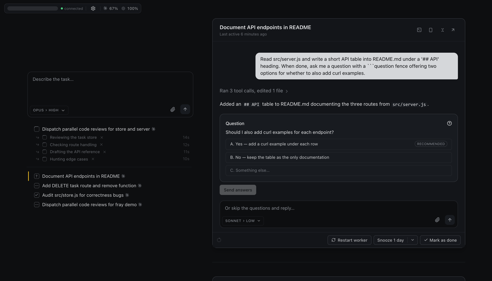
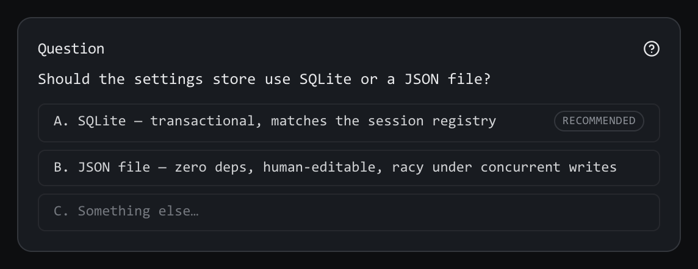
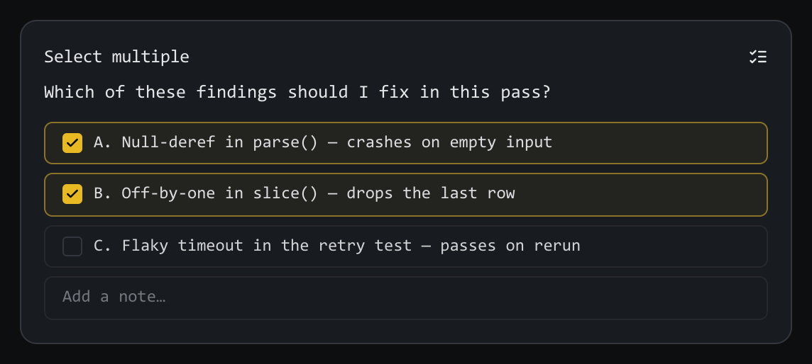
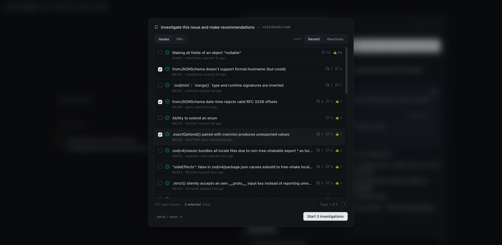
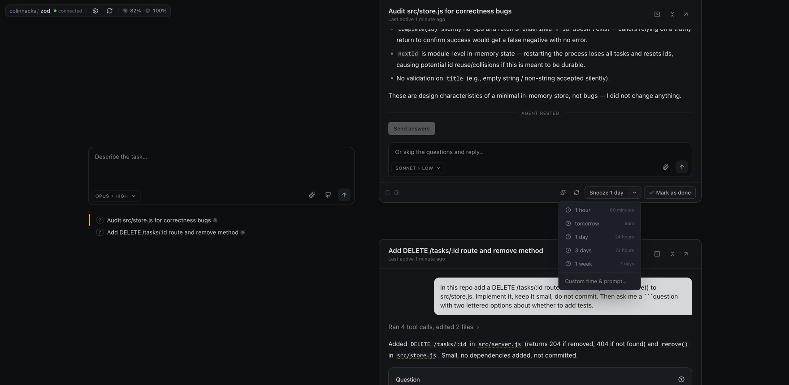
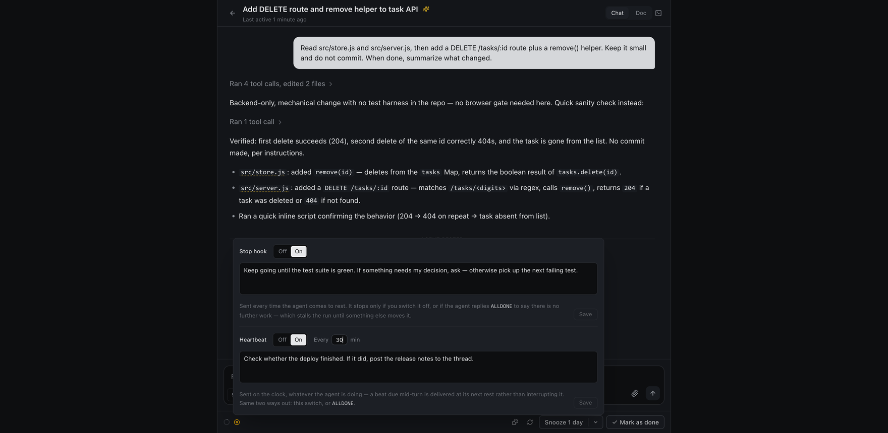

<p align="center">
  <h1 align="center"><br/>Frizz</h1>
  <p align="center">A local web UI for running many coding agents at once.
    <br/>
    by <a href="https://x.com/colinhacks">@colinhacks</a>
  </p>
</p>
<br/>

<p align="center">
<a href="https://opensource.org/licenses/MIT" rel="nofollow"></a>
<a href="https://www.npmjs.com/package/frizz" rel="nofollow"></a>
<a href="https://github.com/colinhacks/frizz" rel="nofollow"></a>
</p>

<br/>

Frizz is for you if you have any of these opinions:

- Terminal UIs are dated and have fundamental limitations that are incompatible with good user experience.
- Orchestrator-style apps like Conductor feel overly complex.
- It's annoying to constantly switch between sessions to check in on my agents' progress.

<br/>

<h2 align="center">Getting started</h2>

**Requirements.** Node 22.13+, and the [Claude Code](https://claude.com/claude-code) or [Codex](https://developers.openai.com/codex) CLI installed and signed in — Frizz drives the subscription you already pay for.

Then run it in any directory — a repo, a jj checkout, or a folder of scripts. Frizz has no opinion about version control and does not require Git.

```sh
$ cd path/to/acme
$ npx frizz

  FRIZZ v0.4.0  ready in 4.0s

  ➜  Local:    http://127.0.0.1:9393/project/acme/
  ➜  Project:  acme — path/to/acme
  ➜  Logs:     ~/Library/Application Support/Frizz/projects/979dae3c-fe15-4038-817e-11d0e7491959/logs/frizz-2026-08-01T13-44-43-16931.log

  press ctrl-c to stop · run with --debug for the full event feed
```

A browser tab opens on localhost — a dedicated workspace for this directory. **One tab per project!** One Frizz serves every project on the machine, each at its own `/project/<name>` URL, so running it in a second directory joins the server already running rather than starting another. Runs on macOS, Linux, and Windows.

<p align="center">
  
</p>

<br/>

<h2 align="center">Features</h2>

Frizz is a browser tab, a queue, and the agent CLIs you already pay for. It brings no model of its own, automates none of your workflow, and keeps every opinion it does have in a text file you can edit.

- 🗂️ **A task queue, not a sidebar.** Every agent that comes to rest needing you becomes a card. Work the queue top to bottom instead of polling ten terminals.
- 🔌 **Headless.** Every thread's agent runs in its own detached background process. Close the tab, quit the browser, ctrl-c the server, reboot — your threads are all still there when you come back, and Frizz reconnects to the ones still running rather than replaying them from disk.
- 🤖 **Claude Code *and* Codex.** Pick the backend per thread and run both against the same repo at once. Frizz supports Claude Code and Codex subscriptions — the CLIs you already have installed and signed in.
- 😴 **Snooze.** Not everything needs an answer now. Park a card for an hour, until tomorrow morning, or until a date you pick — optionally with a follow-up prompt attached, so the thread wakes up already working on what you told it to do next.
- 🔄 **Heartbeats.** Give a thread a prompt that repeats — every time it comes to rest, on a clock you set in minutes, or both. Good for "keep going until CI is green" without you re-asking. A scheduled one reaches the agent even mid-turn, so it can nudge a thread that never stops. Switch it off whenever, or let the agent say it's finished.
- 🐙 **GitHub integration.** Browse your repo's issues and pull requests without leaving the composer, and turn a selection of them into threads. Workers can read issues, diffs, and CI on their own.
- 👀 **Built-in CI and PR watchers.** A worker waiting on a build or a review doesn't hand the thread back to you to be told "keep going." It watches, and picks the work back up when the run goes green or a review lands.
- 📝 **No magic.** A thread behaves like a Claude Code session you started yourself. Frizz adds no worktrees, no branches, no dev server, no build integration, no workflow engine to fight with.
- 🔒 **Local only.** No cloud, no account, no telemetry. The server binds `127.0.0.1` by default and its state lives in your user directory, never in your checkout.

### The queue

A sidebar of sessions makes every agent something you have to remember to go check. Frizz gives you one queue instead.

When an agent comes to rest needing you, a card is added to it. You can quickly evaluate what it has done since your last message and decide to answer its questions, steer it, snooze the card, or mark the session complete. You're continuously presented with a set of action items in one place, instead of constantly switching back and forth between sessions.

The queue is strict about what earns a card, which is what keeps it a real todo list. A thread resting only because *its own* helpers are still working isn't waiting on you, so it stays quiet until they're back. Nothing shows up just to be dismissed.

**Threads are built to run without you.** A worker keeps going until it reaches something only you can settle — a product call, a fork where guessing wrong is expensive to undo, an irreversible action — and then it hands back an answerable *question* rather than a wall of text for you to re-read and interpret.

<p align="center">
  
</p>

Options are lettered and answered in one click, and a worker marks its own recommendation when it has one — so the common case is a single keystroke. There is always a row for writing something else instead.

When the answer isn't one thing, the same card takes several: check any combination and add a note.

<p align="center">
  
</p>

### GitHub

Browse the repo's issues and pull requests from the composer, select any number of them, and each becomes its own thread.

<p align="center">
  
</p>

Workers can also read issues, diffs, and CI on their own — but only read. A worker never comments, labels, closes, or merges unless you ask it to.

### Snooze

Park a card for an hour, until tomorrow morning, or until a date you pick. Attach a follow-up prompt and the thread wakes up already working on it.

<p align="center">
  
</p>

### Heartbeats

Give a thread a prompt that repeats. Send it every time the agent comes to rest, on a clock you set in minutes, or both — a scheduled send reaches the agent even mid-turn, without cutting off work in progress.

<p align="center">
  
</p>

<br/>

<h2 align="center">CLI</h2>

```sh
$ npx frizz --help

Frizz production launcher

Usage: npx frizz [options] [repository]

Runs the npm-resolved immutable Frizz package, then opens it in your default browser. Use frizz-dev
only for a source checkout.

Options:
  --app                  use the legacy dedicated app window instead of a browser tab
  --no-app               print the URL without opening a browser
  --port <port>          request a fixed port for a new workspace server
  --host [address]       serve on a network address instead of loopback (bare --host means 0.0.0.0)
  --allowed-host <name>  with --host, also accept this DNS name as the board's address (repeatable)
  --public-origin <url>  serve behind a proxy/tunnel reachable at this exact origin
  --link                 print a fresh single-use access link for the running board
  --debug                stream the full event feed to the terminal instead of the compact readout
  -h, --help             show this help

Environment:
  FRIZZ_HOST              same as --host
  FRIZZ_ALLOWED_HOSTS     same as --allowed-host, comma separated
  FRIZZ_PUBLIC_ORIGIN     same as --public-origin
  FRIZZ_PUBLIC_TOKEN      standing secret for HEADLESS boxes that cannot show a QR

--host puts a board that can run shell commands as you on the network, and Frizz has no login: anyone
who reaches the port controls it. Only do this on a network you trust. An IP address works as-is; to
reach the board by DNS name you must list that name with --allowed-host ("*" allows any).

--public-origin serves the board through a tunnel or reverse proxy without putting it on the LAN
at all — Frizz stays on loopback and the tunnel dials it. It prints a SINGLE-USE access link, and
shows it as a QR so you can scan it from a phone; press L for a fresh one at any time. Scanning it
trades the code for a session cookie, so the link itself stops working the moment it is used.
```

<br/>

<h2 align="center">FAQ</h2>

<details>
<summary><b>Does Frizz run its own agent or model?</b></summary>

> No. It drives the Claude Code or Codex CLI already installed and signed in on your machine. Your subscription, your rate limits, your settings.

</details>

<details>
<summary><b>Does anything leave my machine?</b></summary>

> Nothing from Frizz. There's no account, no telemetry, and the server binds to `127.0.0.1` unless you ask for otherwise with `--host`. The agents themselves talk to their providers, and `gh` talks to GitHub, but Frizz is a local process looking at local files.

</details>

<details>
<summary><b>What happens if I close the tab?</b></summary>

> Nothing. Each thread's agent runs in its own detached background process, independent of the browser *and* of Frizz itself — you can stop Frizz entirely and your agents keep working. Relaunch, and it reconnects to the sessions that are still running.

</details>

<details>
<summary><b>Does it put junk in my repo?</b></summary>

> Barely. Dispatching a thread writes no thread file into your repo — the agent session *is* the thread. All Frizz adds to your working tree is a `.frizz/` directory holding a scratch directory per thread (empty unless the agent writes something in it) plus a couple of tiny hook state files. Everything durable lives outside your checkout, under `~/.frizz/` if you already have one and otherwise in your platform's own data directory (`~/Library/Application Support/Frizz` on macOS, `$XDG_DATA_HOME/frizz` on Linux, LocalAppData on Windows), so you can delete `.frizz/` and keep every thread and setting. Frizz does not touch your `.gitignore`, so add `.frizz/` yourself if you don't want it in `git status`.

</details>

<details>
<summary><b>Do I have to use worktrees?</b></summary>

> No. Frizz doesn't own your git workflow and won't create branches or worktrees behind your back. Tell your agents what you want in `FRIZZ.md`. If you do run Frizz inside a linked worktree, it isolates that worktree's state from its siblings automatically.

</details>

<details>
<summary><b>Can I run it on several repos at once?</b></summary>

> Yes — one server and one tab per repo, each fully isolated. There is deliberately no cross-repo board.

</details>

<details>
<summary><b>Can I reach it from another machine?</b></summary>

> Yes, with `--host` — the flag every dev server has, and it means the same thing here:
>
> ```sh
> npx frizz --host              # every interface, i.e. 0.0.0.0
> npx frizz --host 192.168.1.5  # one interface
> ```
>
> Frizz prints the addresses to use and warns you as it starts. Reaching it by IP works as-is; reach it by name and you have to say so — `--host --allowed-host frizz.local` — because an unlisted name is how DNS rebinding gets a browser to treat an attacker's page as same-origin with your board. `FRIZZ_HOST` and `FRIZZ_ALLOWED_HOSTS` do the same thing when the launch command lives in an image or a unit file.
>
> Understand what you're turning on. Frizz has no login: reaching the port *is* the authorization, and the board runs shell commands as you. Only do this on a network you trust, and prefer a tunnel (`ssh -L 9393:127.0.0.1:9393 you@box`, using the port Frizz printed, the same on both ends) if you just want your own board from your own laptop — that needs no flag at all.

</details>

<details>
<summary><b>Can I reach it from anywhere, not just my LAN?</b></summary>

> Yes — put it behind a tunnel and tell Frizz the address the tunnel answers on, with `--public-origin`:
>
> ```sh
> npx frizz --public-origin https://frizz.example.com
> cloudflared tunnel --url http://127.0.0.1:9393   # the port Frizz printed
> ```
>
> Frizz stays bound to `127.0.0.1` — `--public-origin` is not `--host` and does not put anything on your LAN. The tunnel runs on the same machine and dials the loopback port, so the only way in is through the tunnel. That is also what makes this the *good* remote option rather than merely a working one: the tunnel terminates TLS, so the board is a real `https://` origin and therefore a secure context, which plain `--host` over a LAN IP is not. Copy buttons and desktop notifications work again, and it works on a phone.
>
> The address you pass must be the exact origin your browser shows — scheme and host, no path. Frizz accepts that one origin, and accepts `X-Forwarded-*` only on requests that actually arrived as it.
>
> Frizz prints a **single-use** access link and renders it as a QR in your terminal, so you can scan it from a phone without typing forty characters. Scanning trades the code for a session cookie and the link immediately stops working; press **L** any time for a fresh one. A code expires in five minutes, and a spent one says so rather than failing silently.

**Even so: Frizz has no accounts, so that link — and anything you put in front of the tunnel — *is* your access control.** A bare tunnel publishes a shell-capable board to the open internet for anyone who has the URL. Require authentication at the proxy — with Cloudflare, that means a [Cloudflare Access](https://developers.cloudflare.com/cloudflare-one/policies/access/) application over the hostname, with a policy allowing only your own email, created *before* the hostname resolves. Tailscale Serve is the same idea with device identity instead of SSO. Frizz prints this warning on every launch that names a public origin, and it is not boilerplate.

</details>

<details>
<summary><b>What platforms does it run on?</b></summary>

> macOS, Linux, and Windows. Windows support landed once the last dependency that had no native Windows build was removed.

</details>

<details>
<summary><b>How is this different from the other orchestrator apps?</b></summary>

> Those apps wrap your agents in their own workflow. Frizz doesn't: it's a viewer and a queue over the CLIs you already run, with every piece of orchestration judgment sitting in editable text instead of inside the binary.

</details>

<br/>

<h2 align="center">Glossary</h2>

Frizz has its own small vocabulary. Most of it names a feature, so this doubles as an index of the opinionated parts.

| Term | What it means |
| --- | --- |
| **Thread** | One effort, start to finish. Not a chat tab and not a branch. The session *is* the thread — there's no sidecar document to keep in sync, and dispatching doesn't write a file into your repo. |
| **Worker** | The agent driving a thread: a real Claude Code or Codex process, running as *you*, with your credentials and your CLI config. |
| **Sub-agent** | A helper a worker dispatches for an independent prong of its own task. Frizz binds each one back to its parent, so the fan-out is visible under the parent's card. |
| **Rested** | An agent that has ended its turn and is waiting on a human. A rested thread isn't idle, it's *your move*. |
| **The queue** | The single list of threads that need you. A thread only earns a card when it genuinely wants a human. |
| **Snooze** | Hide a card until later — an hour, tomorrow morning, or a date you pick — optionally with a follow-up prompt attached. |
| **Heartbeat** | A prompt that repeats on its own — every time a thread rests, on a clock, or both — until you switch it off or the agent says it's done. |
| **Scratchpad** | A thread's durable working memory, readable under its **Doc** tab. Where a worker keeps what a summary would otherwise lose: the approach, the alternatives it rejected, the decisions you made and reversed. |
| **`FRIZZ.md`** | An optional file at your repo root whose contents are injected into every thread, for when you want agents to follow your repo's own norms. |

<br/>

<h2 align="center">Docs</h2>

- [`ARCHITECTURE.md`](ARCHITECTURE.md) — the invariants, layout, and design decisions. Read it before changing anything.
- [`FRIZZ.md`](FRIZZ.md) — this repo's own worker norms, as a worked example of the optional per-repo prompt.

<br/>

<h2 align="center">Contributing</h2>

Issues and pull requests are welcome. Fork the repo, branch off `main`, and open the PR against `main` — CI runs on every pull request.

Three checks run in CI, and they need no install:

```sh
$ node --test board/*.test.mjs
$ node scripts/sync-portable-monitors.mjs --check
$ node --test monitors/*.test.mjs
```

Everything else runs locally. Install with `pnpm install`, typecheck with `pnpm typecheck`, and run the full suite with `pnpm test` — that suite drives real agent CLIs and a real browser, which is why CI does not gate on it. Say in the PR what you ran.

<br/>

<h2 align="center">License</h2>

MIT
